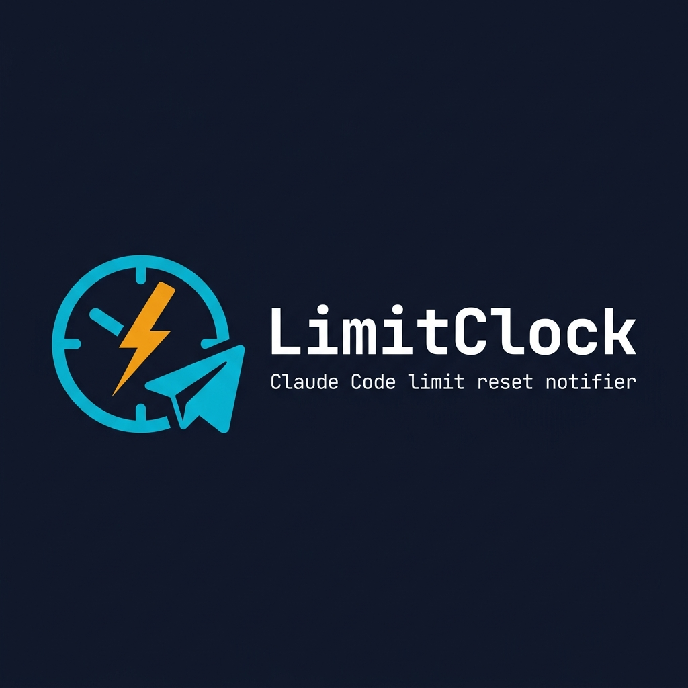

<p align="center">
  
</p>

<p align="center">
  <strong>Telegram Bot that sends you notification when your Claude Code rate limit resets.</strong>
</p>

<p align="center">
  <a href="#quick-start">Quick Start</a> •
  <a href="#commands">Commands</a> •
  <a href="#how-it-works">How It Works</a> •
  <a href="#run-as-service">Run as Service</a> •
  <a href="#license">License</a>
</p>

---

## What is this?

Claude Code has a **rolling 5-hour rate limit window**. When you hit it, you're stuck waiting — but you don't know exactly *when* tokens free up.

**LimitClock** watches your local Claude Code session files and sends you a Telegram notification the moment your tokens reset. No more refreshing, no more guessing.

## Quick Start

### 1. Create a Telegram Bot

1. Open [@BotFather](https://t.me/BotFather) on Telegram
2. Send `/newbot` and follow the prompts
3. Copy the **bot token**

### 2. Get Your Chat ID

1. Open [@userinfobot](https://t.me/userinfobot) on Telegram
2. Send `/start`
3. Copy your **chat ID**

### 3. Install & Run

```bash
# Clone
git clone https://github.com/myrosama/LimitClock.git
cd limitclock

# Install deps
npm install

# Configure
cp .env.example .env
# Edit .env with your bot token and chat ID

# Run
npm start
```

Or use the one-liner:
```bash
curl -fsSL https://raw.githubusercontent.com/myrosama/LimitClock/main/install.sh | bash
```

### 4. Deploy to Cloudflare (Optional but recommended)
If you want the bot to message you even when your laptop is completely powered off, deploy the Cloudflare Worker!
```bash
cd worker
npm install
npx wrangler deploy
```
*(Make sure to update `sync.js` with your deployed worker URL!)*

## Commands

| Command | Description |
|---------|-------------|
| `/status` | Quick rate limit overview with progress bar |
| `/stats` | Full usage breakdown — tokens, models, peak hours |
| `/when` | Exact countdown to next token release |
| `/chatid` | Show your Telegram chat ID |
| `/help` | List all commands |

### Example Messages

**Status Check:**
```
🕐 LimitClock Status

▓▓▓▓▓▓▓▓▓▓▓▓░░░░░░░░ 62% window elapsed
📊 Tokens in window: 847,293
⏳ Next token release: 1h 54m
```

**Limit Reset Notification:**
```
🟢 Claude Code Limit Reset!

Your rate limit window has rolled over.
🎉 25,398 tokens freed up!

Go build something amazing! 🚀
```

**Full Stats:**
```
📊 LimitClock Stats
━━━━━━━━━━━━━━━━━━━━━━

🔢 Total: 2,847,293 tokens
📥 In: 1,203,847 │ 📤 Out: 394,221
💾 Cache W: 847,293 │ 📖 Cache R: 401,932

🤖 API calls: 1,247

📈 Models:
  • claude-sonnet-4-20250514: 1,847,293
  • claude-opus-4-20250414: 1,000,000

⚡ Last hour: 23,847 tokens
📅 Last 24h: 394,221 tokens
🏆 Peak hour: 14:00
📚 ≈ 28.5 novels worth of text
```

## How It Works

LimitClock offers two modes: **Local Mode** and **Cloud Mode**.

### Cloud Mode (Recommended)
Because Claude Code stores data locally on your laptop, a normal cloud server can't read it. Cloud Mode splits the work:
1. You run `node sync.js` on your laptop after coding (or add an alias like `alias cl="claude && node sync.js"`).
2. The script parses your token usage and finds your exact limit reset time.
3. It securely pushes this timer to a free **Cloudflare Worker**.
4. You can turn your laptop off! The Cloudflare Worker holds the timer, sends you the Telegram notification at exactly the right minute, and replies to all your `/status` and `/stats` commands natively via Webhooks!

### Local Mode (Always On)
```
~/.claude/projects/**/*.jsonl  ──→  LimitClock (systemd)  ──→  Telegram Bot
       (session data)               (parser + watcher)          (notifications)
```
If you prefer not to use Cloudflare, you can just run LimitClock in the background on your laptop. It watches your files and schedules the Telegram pings locally.

### Option A: systemd (Linux)

```bash
# Copy service file
cp limitclock.service ~/.config/systemd/user/

# Enable & start
systemctl --user daemon-reload
systemctl --user enable limitclock
systemctl --user start limitclock

# Check status
systemctl --user status limitclock

# View logs
journalctl --user -u limitclock -f
```

### Option B: pm2

```bash
npm install -g pm2
pm2 start index.js --name limitclock
pm2 save
pm2 startup  # auto-start on boot
```

### Option C: Just run it

```bash
# In a tmux/screen session
npm start
```

## Configuration

All config lives in `.env`:

```env
TELEGRAM_BOT_TOKEN=your_bot_token_here
TELEGRAM_CHAT_ID=your_chat_id_here
```

| Variable | Description |
|----------|-------------|
| `TELEGRAM_BOT_TOKEN` | Bot token from @BotFather |
| `TELEGRAM_CHAT_ID` | Your personal chat ID |

## Requirements

- **Node.js** ≥ 18
- **Claude Code** installed (reads from `~/.claude/`)
- **Telegram** account

## Contributing

PRs welcome! This is a simple tool — if you have ideas for more stats, better notifications, or platform support, open an issue.

## License

MIT — do whatever you want with it.

---

<p align="center">
  Built because waiting for rate limits without knowing when they reset is painful. 🕐
</p>
